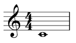

# MusicXML


[](https://travis-ci.org/dn-m/MusicXML)
[](https://codecov.io/github/dn-m/MusicXML)

A **work-in-progress** implementation of the [musicXML](https://www.musicxml.com) specification in Swift.

The goal of this project is to allow Swift users to read, manipulate, and write musicXML files in a richly-typed manner on any platform supported by Swift.

## Hello, world!

Let's construct the "Hello, world!" score example from the [musicXML documentation](https://www.musicxml.com/tutorial/hello-world/). This musical composition consists of one measure that contains a whole note on middle C, based in 4/4 time:

### Graphical Representation

When rendered graphically, this score example should look something like this:



### musicXML Representation

The musicXML representation looks like this:

```XML
<?xml version="1.0" encoding="UTF-8" standalone="no"?>
<!DOCTYPE score-partwise PUBLIC
    "-//Recordare//DTD MusicXML 3.1 Partwise//EN"
    "http://www.musicxml.org/dtds/partwise.dtd">
<score-partwise version="3.1">
  <part-list>
    <score-part id="P1">
      <part-name>Music</part-name>
    </score-part>
  </part-list>
  <part id="P1">
    <measure number="1">
      <attributes>
        <divisions>1</divisions>
        <key>
          <fifths>0</fifths>
        </key>
        <time>
          <beats>4</beats>
          <beat-type>4</beat-type>
        </time>
        <clef>
          <sign>G</sign>
          <line>2</line>
        </clef>
      </attributes>
      <note>
        <pitch>
          <step>C</step>
          <octave>4</octave>
        </pitch>
        <duration>4</duration>
        <type>whole</type>
      </note>
    </measure>
  </part>
</score-partwise>
```

### Constructing the "Hello, world!" example using the `MusicXML` library

Let's build up this musical example from the ground up, using the `MusicXML` library. 

First, we will create our whole note:

```Swift
let note = Note(
	pitch: Pitch(step: .c, octave: 4), 
	duration: 4, 
	type: .whole
)
```

Let's establish our `Key`, `Time`, and `Clef`:

```Swift
let key = Key(fifths: 0)
let time = Time(4,4)
let clef = Clef(sign: .g, line: 2)
```

We can bundle these attributes up:

```Swift
let attributes = Attributes(
    divisions: 1,
    keys: [key],
    times: [time],
    clefs: [clef]
)
```

Now, we have all the information we need to put together our single measure. In this case, we are traversing the score in a partwise fashion, so we will create a `Partwise.Measure`. Otherwise, we would create a `Timewise.Measure`.

```Swift
let measure = Partwise.Measure(
    number: "1",
    musicData: [
        .attributes(attributes),
        .note(note)
    ]
)
```

We have all of the musical information under control, so let's do some administrative work to declare who is playing this music. We will start by creating a single part. Again, as we are traversing the score in a partwise fashion, we will create a `Partwise.Part`, rather than a `Timewise.Part`. We can keep track of this part by its identifier, `"P1"`.

```Swift
let part = Partwise.Part(id: "P1", measures: [measure])
```

Almost there. We just need to declare all of the parts in our composition so that we can keep track of things at a high level.

```Swift
let header = Header(
	partList: PartList([
		.part(ScorePart(id: "P1", name: "Music"))
	])
)
```

We can package up our `header` and our solo `part` into a `Partwise` traversal of the work.

```Swift
let traversal = Partwise(header: header, parts: [part])
```

And then place our traversal inside a `Score`.

```Swift
let score = Score(traversal: .partwise(traversal))

```

Et voilà, we have willed into being a `MusicXML` value which represents our rigorous masterpiece.

```
let musicXML = MusicXML(score)
```

### 🧬 Decoding musicXML into a `MusicXML.Score`

You can decode a `MusicXML` structure in a variety of ways:

```Swift
let fromData: MusicXML = try MusicXML(data: data)
let fromString: MusicXML = try MusicXML(string: string)
let fromURL: MusicXML = try MusicXML(url: url)
```

If you decode the musicXML representation of our "Hello, world!" composition, you will get a value equivalent to the one you have built by hand above.

### 🚧 Work-in-progress: Encoding a `MusicXML.Score` into musicXML

[Pre-release version 0.3.0](https://github.com/dn-m/MusicXML/milestone/1) will see the completion of the encoding from a `MusicXML.Score` into the musicXML format.


## Getting Started

### Requirements

Use the [Swift Package Manager](https://swift.org/package-manager/) to include the `MusicXML` module into your project.

### Usage

If you want to use the `MusicXML` module in your own project, add the `MusicXML` package to the `dependencies` section of your `Package.swift` file:

```Swift
let package = Package(
    name: ...,
    products: [ ... ],
    dependencies: [
        ...,
        .package(url: "https://github.com/dn-m/MusicXML", from: "0.2.0")
    ],
    targets: [ ... ]
)
```

### Development

To contribute to the `MusicXML` package, clone the `git` repository:

```
git clone https://github.com/dn-m/MusicXML && cd MusicXML
```

Build the package:

```
swift build
```

Run the tests:

```
swift test
```

If you use the Xcode IDE, use the Swift Package Manager to generate an `.xcodeproj` file:

```
swift package generate-xcodeproj
```

### Development Roadmap

The upcoming pre-release versions will be focused on completing different tasks.

### 0.3.0

Pre-release version **0.3.0** will be defined by completing the implementation of the **encoding** of **abstract musical content**. The LilyPond Test Suite tests will be transformed into round-trip tests to ensure that the plumbing is clean.

### 0.4.0

Pre-release version **0.4.0** will be defined by refining the public interfaces exposed by the `MusicXML` package. Up until this point, pubic initializers may be somewhat clumsy.


## More Resources

See the [MusicXML XSD Schema Reference](http://usermanuals.musicxml.com/MusicXML/MusicXML.htm#MusicXMLReference.htm%3FTocPath%3DMusicXML%2520Reference%7C_____0) for more information about how musicXML is structured.
